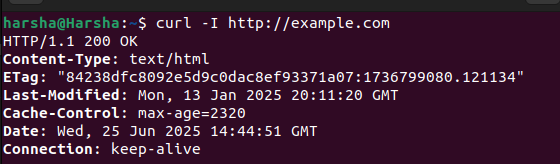

# How the Web Works

+ Let's understand what happens when you type an URL and press `enter` in any browser with an example of `https://example.com/`.  

## Step 1: URL Prasing  

### The browser seperates the URL to understand.  

+ From the example:  
+ `https`: This is the protocol to be used.  
+ `example.com`:This is the domain name.  
+ `/`:This the homepage path of the website.  
+ HTTPS uses port 443 as a default port.  

## Step 2: OS/Browser cache checking

+ After the browser understands to which domain it should connect it checks it's cache for the IP Address of the particular domain.  

## Step 3: DNS Resolution  

### If the IP address is not cached then:  

## Step 4: TCP Handshake

+ After the browser receives the IP address it try to establish a Three way handshake.
+ SYN Flag : Browser send a synchronization packet.
+ SYN+ACK Flag : Server acknowlwdges and synchronizes back.
+ ACK Flag : Browser acknowledges back.  
**Note:**If `HTTPS` is used TLS Handshake is used.In this the browser and server exchange encryption keys,with this a secure cahnnel is created.  

## Step 5 : HTTP GET Request

In this step the browser requests the server to send the details of the homepage for the domain.

## Step 6 : Server's Response

After receveing the HTTP GET Request the server prepares a  'HTTP Response' and the `html` file of the websites homepage along with it.

## Step 7 : Rendering of hompage

The browser understands the HTML file, downloads images or any other refernce material and renders the hompage on the screen.

## Summary :

