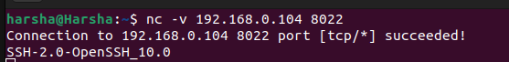
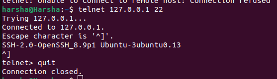
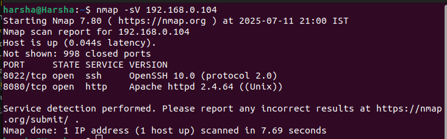

# Banner Grabbing

Banner grabbing is a reconissance technique used to gather information about a service running on an open port of the target system.

## Tools Used:

1. NetCat(nc)
2. telnet
3. Nmap

### 1. NetCat (nc):

**Syntax:** ```nc -v <target_ip> <port_no.>```  


### 2. telnet

**Syntax:**  ```telnet <target_ip> <port_no.>```  


## 3. Nmap:

`nmap` is a command used to check which ports are open on the target system.  
**Syntax:**  ```nmap -sV <target_ip> <port_no.>```
