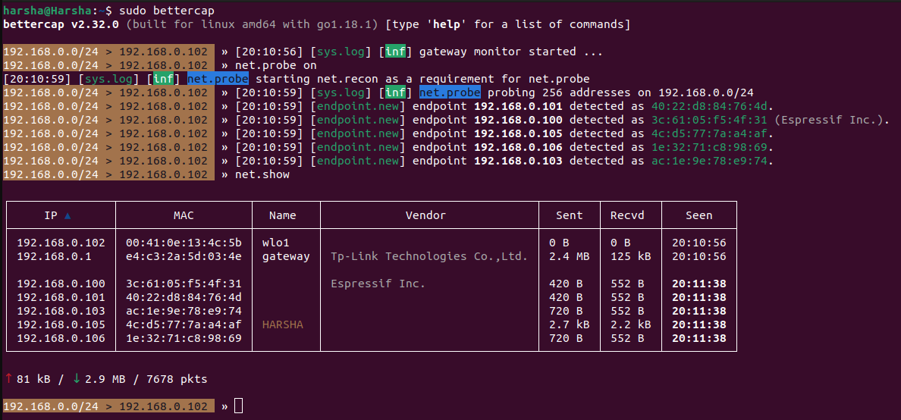
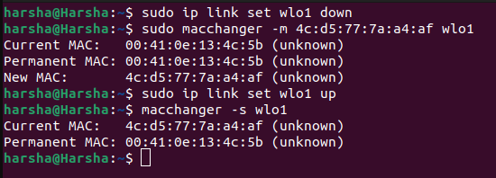
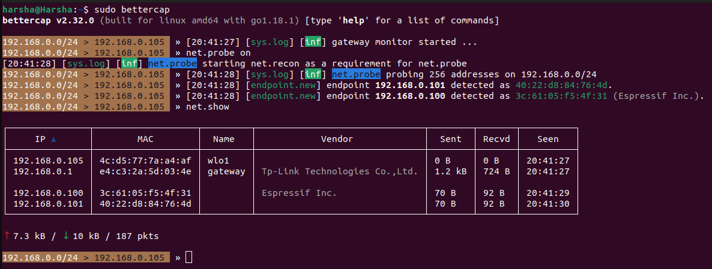

# MAC Spoofing

+ MAC spoofing is a process of changing the MAC address of a device to pretend like another device on the same network.  
+ MAC address is unique address set bu=y the device manufracturer that cannot be changed permanently.  

## Achive MAC spoofing using Bettercap

+ Step 1:Launch bettercap by using `sudo bettercap` command.  

+ Step 2: Use bettercap to find a MAC address.  

To find a MAC address use `net.probe on` and `net.show` commands.And exit bettercap.
  

+ Step 3: Select the MAC address which is to be spoofed.  

We can change the MAC address using `macchanger`

+ Step 4: To install `macchanger` on your device use:  
`sudo apt install macchanger`  

+ Step 5: Bring down your network interface before changing the MAC address:  
`sudo ip link set <interface> down`

+ Step 6: Change your MAC address using macchanger:  
`sudo macchanger -m <target-mac-address> <interface>`

+ Step 7: Bring your network interface back up:  
`sudo ip link set <interface> up`

+ Step 8: Verify the MAC address change a command or bettercap:  
`ip link show <interface>`  
Verified via command:  

Verified via bettercap:  
