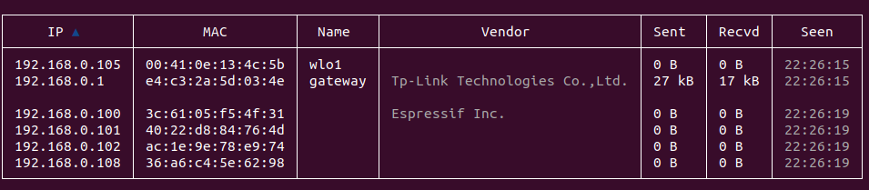

# Bettercap

+ Bettercap is powerful and a modular framework writte in Go.It is used for network reconissance and MInddle-In-The-Man attacks(MITM) accross Wi-Fi,Bluetooth,Ethernet and many more.  

## Installation on linux:

Type the following command on the terminal to install bettercap on linux based systems:  
+ `sudo apt install bettercap`  
+ After installing bettercap type `sudo bettercap` on the terminal and the bettercap interface will open on the terminal.  

## `net.probe on`

+ The `net.probe on` command in bettercap is used for active network probing.  
+ This command actively listens in the local network for live hosts by sending probe packets.  
+ This command identifies live hosts even if the host is not communicating.  
+ The only drawback of this commad is it may alert the blue teams or trigger any defences.  

## `net.recon on`

+ The `net.probe on` command in bettercap is used for passive network reconissance.  
+ This command passively listens in the local network without sending any packets.  
+ The recon command is more stelthier than the probe command.  

To see a detailed version of the above commands we can use `net.show` this command shows IP Address,MAC Address,name,vendor details etc.  

## `net.show`

This command displays the list of discovered live hosts on the network and information such as:  
+ IP address
+ MAC address
+ Name
+ Vendor details
+ Sent & Received packets
+ Last seen  
