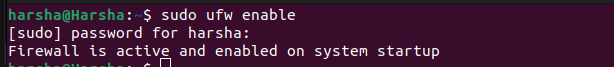
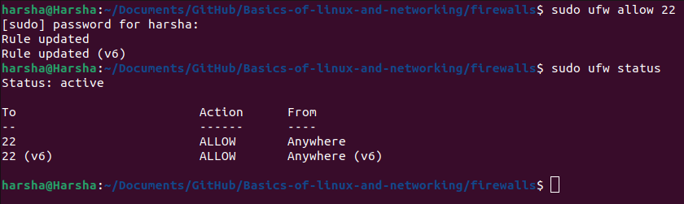
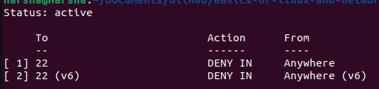
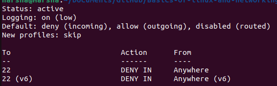
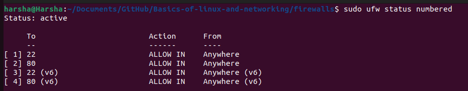

# Firewalls

## What is a Firewall ???

+ A firewall is security system for a computer.It is in the form of hardware and software which controls incoming and outgoing traffic from the network.

## UFW(Uncomplicated Firewall)

+ UFW is a pre-installed tool in linux to manage firewall.  

### Common UFW commands

+ `sudo ufw enable` : This command turns on the firewall of the system on startup.  

+ `sudo ufw disable` : This command turns off the firewall.  

+ `sudo  ufw allow 22` : This command allows Secure Shell.22 is the port number used by SSH  

+ `sudo ufw deny from <ip address>` :This command blocks the given IP Address.  
+ `sudo ufw status numbered	`:This command gives all rules with numbers.  

+ `sudo ufw status verbose` : This command gives a detailed status.  

### UFW status with rules

+ This command shows all active firewall rules with rule numbers which makes it easier to manage.  