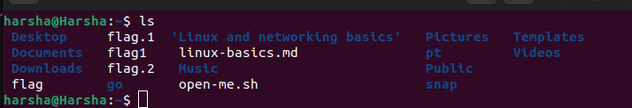
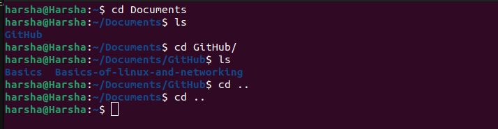
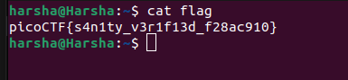
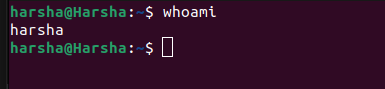
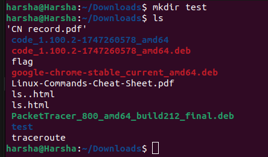

# Basic Commands

## The `ls` command

The **`ls`** conmmand gives all the files/folders in the current working directory.


## The `cd` command

The **`cd`** command stands for change directory.  
We can also backtrack the directories by using `cd ..` command.

### Syntax

```cd <folder_name>```



## The `cat` command

The `cat` command concatenates the contents of the file and prints the content on the terminal window.

### Syntax

``` cat <file_name> ```



## The `whoami` command

This command returns the username of the user currently in use.



## The `pwd` command

This command prints the current directory path.


## The `mkdir` command

This command helps the user to make a new directory.  
mkdir stands for make directory.

