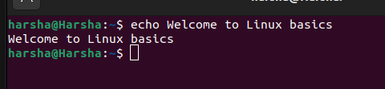
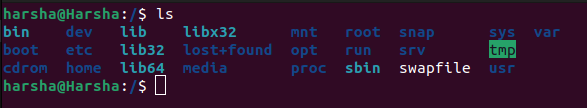
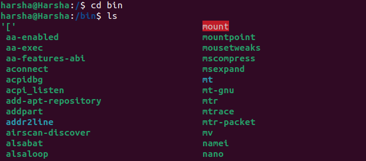
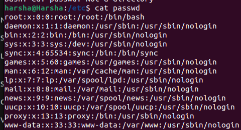

# Basic Commands

## The `ls` command

The **`ls`** conmmand gives all the files/folders in the current working directory.


## The `cd` command

The **`cd`** command stands for change directory.  
We can also backtrack the directories by using `cd ..` command.

### Syntax

```cd <folder_name>```


## The `cat` command

The `cat` command concatenates the contents of the file and prints the content on the terminal window.

### Syntax

``` cat <file_name> ```


## The `whoami` command

This command returns the username of the user currently in use.


## The `pwd` command

This command prints the current directory path.


## The `mkdir` command

This command helps the user to make a new directory.  
mkdir stands for make directory.


## The `echo` command

This command prints the text.



# File Hierarchy and User Management  

## File Hierarchy

## `/root`

+ The `/root` is the parent directory of all the directories in the system.



## `/bin`

+ In linux all the commands which we use are files written in binary.All these commands are stored in the `/bin` folder inside `/root` directory.We can also copy or delete these files from the directory using `sudo`.



## `/sbin`

+ The `/sbin` also known as the super binary contains the commands that only the adminstrators use.Few example commands are `adduser`
,`ifconfig`,`tcptraceroute` and many more.

## `/boot`

+ The `/boot` directory stores all the boot files required when the system starts to boot.

## `/etc`

+ The `/etc` directory stores all the system-wide configaration files and shell scripts.Only the root user can make changes in the `/etc` directory.  
+ In this directory we have a sub-directory for passwords i.e `/etc/passwd` which stores all the user information files.
+ The passwords are stored in `/etc/shadow` directory in a form of a hash code which can be accessed by using `sudo` command.



## User Management

+ Linux can operate with more than one user, each user will have a username, `home` directory and password.

### To create a new user  

+ There are two commands :  
    1.`adduser`
    Syntax : `adduser <username>`  
    2.`useradd`