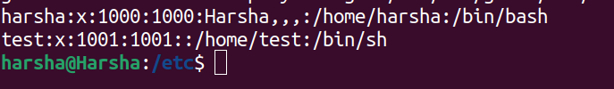
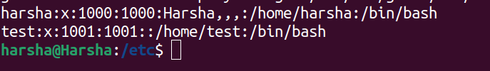
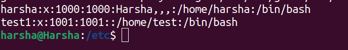
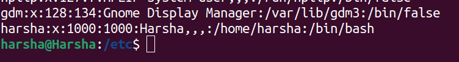
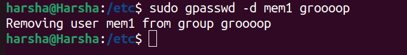

# Basic Commands

## The `ls` command

The **`ls`** conmmand gives all the files/folders in the current working directory.


## The `cd` command

The **`cd`** command stands for change directory.  
We can also backtrack the directories by using `cd ..` command.

### Syntax

```cd <folder_name>```


## The `cat` command

The `cat` command concatenates the contents of the file and prints the content on the terminal window.

### Syntax

``` cat <file_name> ```


## The `whoami` command

This command returns the username of the user currently in use.


## The `pwd` command

This command prints the current directory path.


## The `mkdir` command

This command helps the user to make a new directory.  
mkdir stands for make directory.


## The `echo` command

This command prints the text.


# File Hierarchy and User Management  

## File Hierarchy

## `root`

+ The `root` is the parent directory of all the directories in the system.


## `/bin`

+ In linux all the commands which we use are files written in binary.All these commands are stored in the `/bin` folder inside `/root` directory.We can also copy or delete these files from the directory using `sudo`.


## `/sbin`

+ The `/sbin` also known as the super binary contains the commands that only the adminstrators use.Few example commands are `adduser`
,`ifconfig`,`tcptraceroute` and many more.

## `/boot`

+ The `/boot` directory stores all the boot files required when the system starts to boot.

## `/etc`

+ The `/etc` directory stores all the system-wide configaration files and shell scripts.Only the root user can make changes in the `/etc` directory.  
+ In this directory we have a sub-directory for passwords i.e `/etc/passwd` which stores all the user information files.
+ The passwords are stored in `/etc/shadow` directory in a form of a hash code which can be accessed by using `sudo` command.


## User Management

+ Linux can operate with more than one user, each user will have a username, `home` directory and password.

### To create a new user  

+ There are two commands :  
    1.`adduser`  
    Syntax : `adduser <username>`  
    2.`useradd`  
    Syntax : `useradd <username>` 
+ When we create a user using the `useradd` command the system does not ask for the password for that user.We can add the password by using the `passwd` command.

### Modifying a user

+ We can modify user settings by using `usermod` command.  

+ As we can see in the above image user 'harsha'has a different shell w.r.to user 'test'.Now we can change the shell of a user by using this `usermod`command.  
`sudo usermod test --shell /bin/bash`
+ After using the above command the shell of the test user is changed.  
  
  
+ If we want to change the user name from 'test' to say suppose 'test1', We can do that by using `sudo usermod -l test1 test`  

  
## The `sudo` command

+ This is the most powerful commandin linux  with `sudo` we can do any changes in the system by becoming the root.

## The `su` command

+ `su` stands for switch user. We can switch between user from the terminal, But for that we need to know the password.
+ If in case we do not know the password of the other user `sudo` command will help us.

## The `userdel` command

This command will delete a user from the system.For example lets try deleting 'test1' using `sudo userdel test1` . 

The 'test1'user is deleted from the system.

## The `groupadd` command

+ This command adds a group of users to the system in which there are different users.  
`sudo groupadd groooop`:This creates a new group
+ For adding user to this group we can use the `-aG` tag along with `usermod` command.
`sudo usermod -aG groooop mem1`:This adds new user into the group.  

+ For example to remove a user from the group we use the following command  
+ `Syntax: sudo gpasswd -d <group_name>`  
+ `sudo gpasswd -d mem1 groooop`
