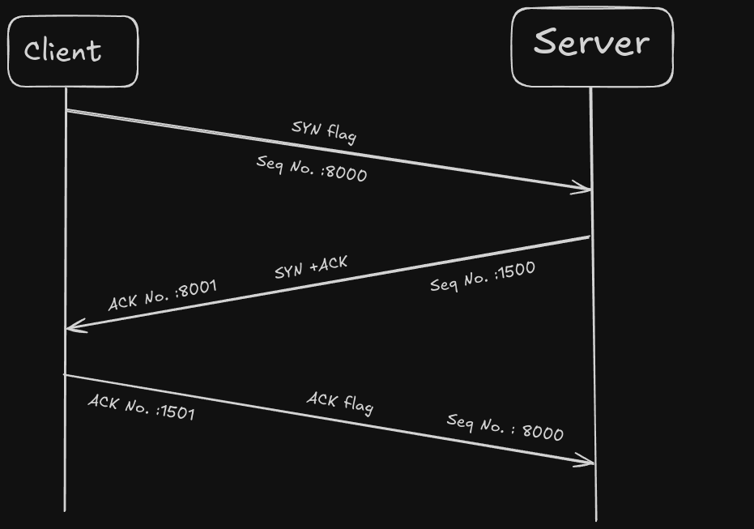
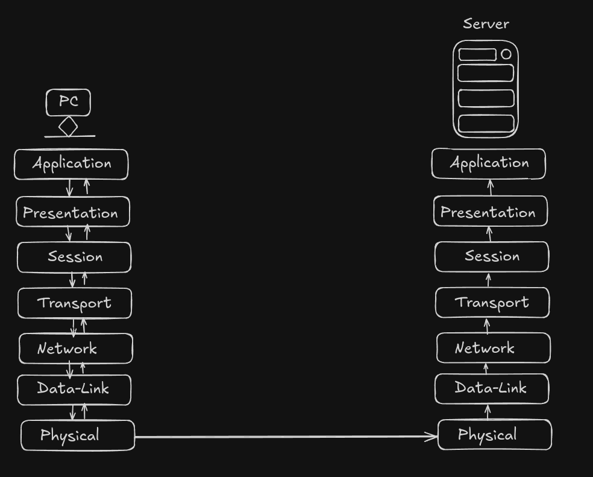
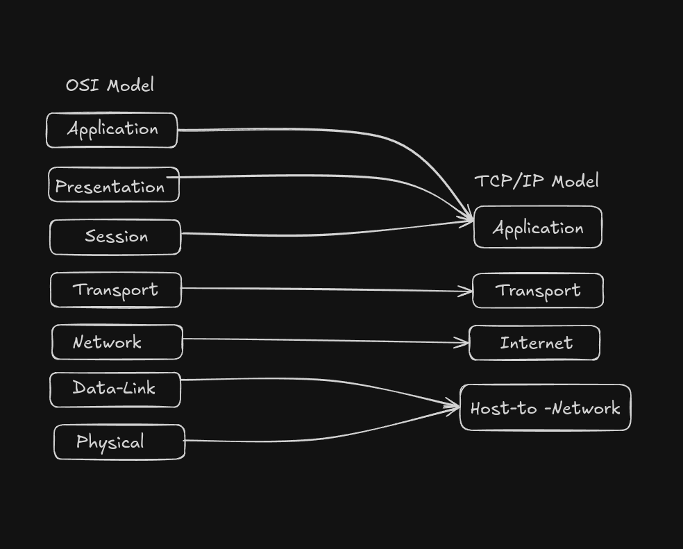

# OSI Model & TCP/IP Theory

## OSI Model

+ The OSI Model (Open Systems Interconnection Model) is a framework used to understand and implement standard protocols in netwokk communications.The OSI Model is divided into 7 layers.Each layer have separate responsibilities which help in smooth transfer of data between two systems.  

| Layer | Name |  
|:------:|:------:|  
|1|Physical|
|2|Data-link|
|3|Network|
|4|Transport|
|5|Session|
|6|Presentation|
|7|Application|

## 1.Physical Layer

+ The Physical layer is the lowest layer in the OSI Model which represents data in the form of bits  
(0's & 1's). This  layer uses physical medium such as cables,NIC's, hubs etc.

### Responsibilities

---

1. Representaion of bits  
2. Data Rate  
3. Line configaration  
4. Physical topology
5. Trasmission mode  

## 2. Data-Link Layer

+ The Data-Link layer of the OSI Model is responsible for node-to-node transmission of data and also ensures the data is transfered error-free.The data is called as 'Frames' in this layer.

### Responsibilities

1. Physical Addressing  
2. Framing
3. Flow control
4. Error control
5. Access control  

### Sub-Layers:

1. Logical Link Layer : This layer helps with synchronization, error checking and flow control.
2. Media Access Control : This layer manages access to to the physical medium by using MAC address.

## 3. Network Layer  

+ The Network Layer of the OSI Model is responsible for transfer of packets accross multiple networks from source to destination that may also be located in another network with the help of IP address(IPv4 or IPv6).The data is called as 'Packets' in this layer.

### Responsibilities

1. Logical Addressing (IP Address)
2. Routing

### Protocols Used:

+ IP : Internet Protocol
+ ICMP : Internet Control Message Protocol
+ OSPF,BGP,RIP : Routing protocols

## 4. Transport Layer :  

+ The Transport Layer of the OSI Model is responsible for end-to-end communication. The data is called 'Segment' in this layer.
+ Port Numbers: In this layer port numbers are used by TCP or UDP protocols to identify the correct application or service.There are a total of 65,535 ports in which 0-1023 ports are registeres ports, 1024-49,151 are reserved ports.
+ For example port 80 is used by 'HTTP' port 21 is used by 'FTP' etc.

### Responsibilities 

1. Service point addressing
2. Segmentation
3. Flow control
4. Error control
5. Connection control

### Protocols used:

1. TCP : Transmission Control Protocol
2. UDP : User Datagram Protocol

|TCP|UDP|
|---|---|
|Connection oriented|Connectionless|
|More Reliable| Less Reliable|
|Slower|Faster|

### Three Way HandShake

## 5.Session Layer

+ The Session Layer of the OSI Model is responsible for establishing, managing, and terminating of sessions.
+ A **session** is a continous exchange of information between two applications or systems.

### Responsibilities

1. Dialog Control
2. Synchronization

## 6. Pesentation Layer

+ The Presentation Layer of the OSI Model is responsible for **translaation, encryption/decryption, compression/decompression** of data from/to the application layer.
+ Common data formats handled are image(JPEG,PNG), video(MP4,AVI), text encodings(ASCII,UTF-8).

### Responsibilities

1. Translation
2. Encryption/decryption
3. Compression/decompression

## 7.Application Layer

+ The Application Layer of the OSI Model is the top most layer and  is responsible for providing network services to the user or the application software by using different protocols.

### Responsibilities

1. File transfer
2. Network virtualization
3. Mail services
4. Remote access

## Real-Life Examples

|**Layer**|**Protocols Used**|
|:---:|:---|
|Application|DNS(53),HTTPS(443),HTTP(80),FTP(20,21)|
|Presentation|JPEG,MP4,ASCII,SCL/TLS|
|Session|NetBIOS,RPC,SMB,PPTP|
|Transport|TCP,UDP,SCTP,DCCP|
|Network|IP,ICMP,IGMP,IPSec|
|Data-Link|ARP,PPP,Ethernet|
|Physical|RJ45,Fiber cable,Wi-Fi|

## TCP/IP Model

+ The TCP/IP Model designed by the U.S Department of Defence is a 4-Layer network communication model.

|Layer|Name|
|:---:|:---:|
|1|Host-to-Network|
|2|Internet|
|3|Transport|
|4|Application|

#### Comparision of OSI to TCP/IP:

## 1.Host-to-Network Layer

+ This layer of TCP/IP Model is resposible for all the responsiblities of both the Physical and Data-Link layers of the OSI Model.

## 2.Internet Layer

+ The Internet layer is same as the 'network'layer of the OSI model but with few added protocols.  

+ **Added protocols:**

1. ARP : Address Resolution Protocol
2. RARP: Reverse Address Resolution Protocol
3. ICMP: Internet Control Message Protocol
4. IGMP: Internet Group Message Protocol

## 3.Transport Layer

+ This layer is same as the'transport' layer of teh OSI Model with one added protocol i.e. **SCTP: Stream Contol Transmission Protocol**.

## 4.Application Layer:

 This layer of TCP/IP Model is resposible for all the responsiblities of Session, Presentation andd the application layers of the OSI Model.