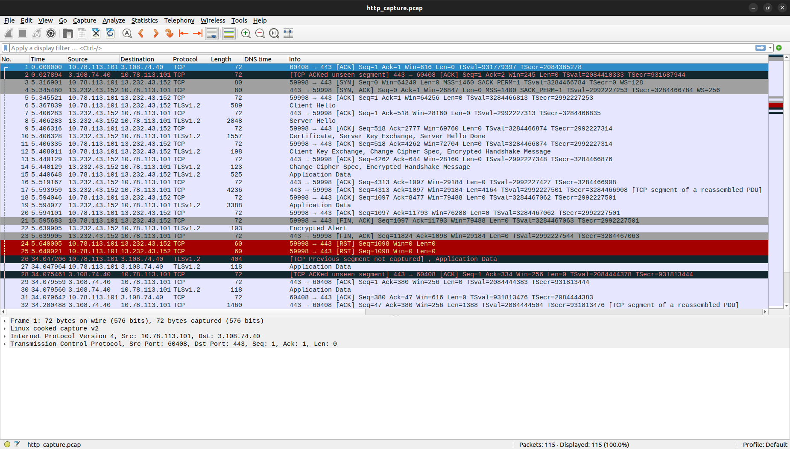

# Packet Analysis Report
---

## Packet Structures

### Ethernet Header (Layer 2)

### IPv4

### Transmission Control Protocol

### User Datagram Protocol

### 1. Dissection of a Captured DNS Packet

DNS packets are usually transmitted over UDP port 53 (or TCP in some cases like large zone transfers).  

+ Command used: `sudo tcpdump -i any port 53 -w dns_query.pcap`

+ It captures all DNS traffic (port 53) on any network interface and saves that traffic into a file called dns_query.pcap for later analysis.of tcpdump
+ Tool used: Wireshark

+ Query: `dig +short www.google.com`  

### DNS query:

In wireshark the DNS query field consits of :
1. Transaaction ID
2. Flags
3. Queries
4. Response Number  

### 2.Dissection of a Captured HTTP Packet

HTTP traffic uses TCP port 80 (or 443 for HTTPS, which is encrypted and not readable unless intercepted with SSL decryption).

+ Python script:

+ Tool used: Wireshark

